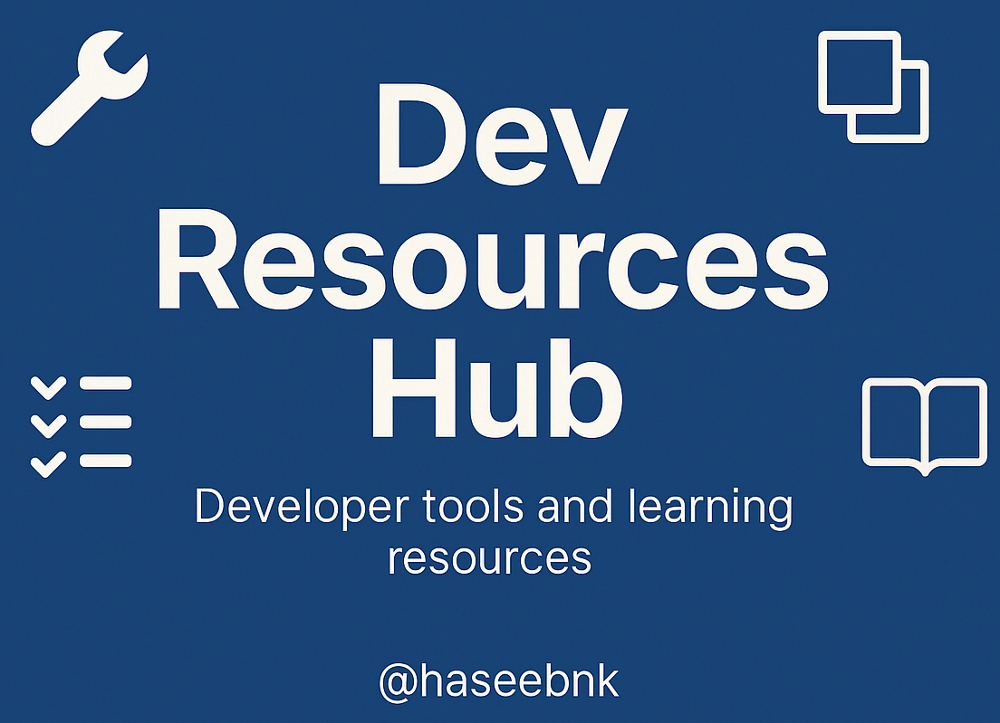

# 🚀 Dev Resources Hub

Your one-stop hub for **Frontend**, **Backend**, **UI/UX Tools**, **Extensions**, **Learning Platforms**, and **Free APIs**.

> A curated list of free tools, libraries, and learning resources to supercharge your development workflow.

---

## 📚 Categories

- 🔧 [Frontend Tools](./frontend-tools.md) – Libraries, frameworks, and utilities
- 🧠 [Backend Tools](./backend-tools.md) – Servers, databases, and dev tools
- 🎨 [UI/UX Tools](./ui-ux-tools.md) – Inspiration, colors, design assets
- 🧩 [Browser Extensions](./dev-extensions.md) – Boost your productivity
- 📖 [Learning Resources](./learning-resources.md) – Courses, docs, and more
- 🌐 [Free APIs](./free-apis.md) – Public APIs for your next project

---

## ✨ How to Contribute

We welcome your contributions!

1. Fork this repository
2. Add your favorite tools/resources in the relevant `.md` file
3. Open a Pull Request 🚀

> Be sure to follow the structure in each file and keep it clean.

---

## 🌟 Star This Repo

If you find this useful, **please give us a star** — it helps us grow and reach more developers!

---

## 🙋‍♂️ Author

**Muhammad Haseeb**  
[GitHub](https://github.com/haseebnk) • [LinkedIn](https://linkedin.com/in/haseebnk)

---

## 📸 Preview

